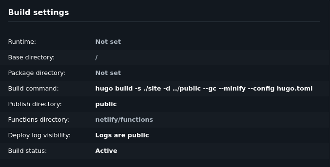

+++ 
draft = false
date = 2025-07-20T16:35:00-03:00
title = "Building my personal site"
description = ""
tags = ["web-development"]
categories = ["development"]
math = false
+++

# Why build a personal site?

Nowadays, it is more important than ever to have a strong presence online. Being
(or at least aspiring to be) a developer just makes this a lot more relevant,
because how you show yourself online is your presentation letter for any
recruiter who might be watching.

### Writing and journaling
On the other hand, there are multiple other reasons I would want to have a
personal site. First of all, I like to write. I don't do it often, but I
recently learnt about journaling and became really drawn to the idea of writing
down thoughts and experiences. Being able to have a register of all these things
to look back upon is something I think is invaluable. 

### Writing and learning
Second, I think writing enhances my ability to learn stuff. When writing down
what I know about a concept, I can really get that concept to stick with me, and
also I can see if I really know what I'm talking about. I think of writing as
trying to explain that concept to someone else, and when synthetizing it down to
a blog post, I can really get a deeper understanding of the topic. This takes me
back to the quote:

> If you can't explain it to a six-year-old, you don't understand it yourself.
> 
> ~ Albert Einstein

### Writing and knowledge
Third, and last, I want a place to document what I learn and work on. Over the
past few years, the way I acquired knowledge on software and programming topics
was to watch a bunch of videos and tutorials, maybe play around a little bit
with what I learned and then forget about it. Some topics stayed with me, and
some didn't. The ones that didn't got lost, and I never had a place where I
documented all that knowledge, so now *I lost track of what I learnt.* That
should never happen, after all, if I don't *know what I know* I will never get
to really know *what I don't know*.

# Technology I used 

I'm a developer, and part of what I like of being a developer is being able to
build systems to do what I want the way I want to do it. And what I really
like is simplicity. I like when the tools I use serve a simple purpose in a
cohesive way, because then they offer me the flexibility to combine them the way
I want.

That is one of the reasons I went with [Hugo](https://gohugo.io/). Hugo is an
open source static site generator, that allows you to turn markdown files into
web pages. It is written in Go and has over 84K stars on github at the time of
writing this post. One of the upsides of using a tool such as this one is the
ability to install custom themes made by the community, which make it easy to
have a beautiful page with little to no additional effort. Maybe in the future
I'll create my custom theme, but right now my focus is writing and learning as
much as I can.

For hosting, I went with Netlify static pages. They are free, simple, and let me
easily set up CI/CD. I can post new things just by pushing to my github repo! It
doesn't get any better than that. Well, that's an overstatement, but the truth
is that they offer me just what I need right now. However, and in the spirit of
learning new things, I find this solution quite boring, so I thought of writing
my own HTTP server in Go. This is in fact really easy to do, and lets me do lots
of fun things, but I'll leave that idea in my backlog for now.

# How I did it

Setting up a Hugo webpage is really easy, you just [install
Hugo](https://gohugo.io/installation/) and run a few commands:

```bash
hugo new site my-site
cd my-site
git init
git submodule add 
git submodule add https://github.com/luizdepra/hugo-coder themes/hugo-coder
echo "theme = 'hugo-coder'" >> hugo.toml
```

I chose the theme [hugo-coder](https://github.com/luizdepra/hugo-coder) as a
starting point, but as I said earlier I might make my own theme in the future.
After tweaking a few things in the config for setting up the theme, I could
create my first post:

```bash
hugo new content content/posts/first-post.md
```

And then build the site with the command `hugo`! Easy as that.

Then, I decided to put all the files used by hugo under the new directory
`site`. This is for keeping things organized and not have all the website files
under the root directory of the project. This will be useful for when I write my
own Go HTTP server, as I'll probably keep everything in the same repo.


To set up Netlify hosting, I created an account and linked it to my Github
account. Then, I created a project on Netlify and linked it to my github repo.
The important part here is configuring the build settings like this:



As I had my site files on a separate directory I needed to specify where they
where with the `-s` flag, and because I wanted to have my built site under a
directory inside my root folder I specified that with the `-d` flag. Finally I
needed to specify where my built site would be, so I configured that under the
`Publish directory` option.

After that, I can just push my changes and deploy my new posts immediately with
a single command! Now, I can just write and forget about everything else,
because I set up an effective workflow for writing and publishing new posts.

Thank you for reading!
